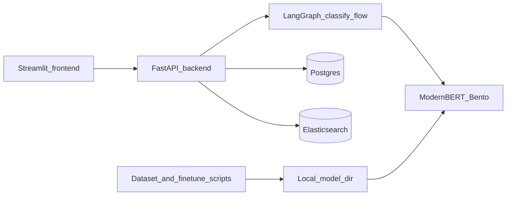

# BitBot

Agentic bot for any business — **BitBot** bootstrap with **issue / no_issue** classification using **ModernBERT** (fine-tuned `MoritzLaurer/ModernBERT-base-zeroshot-v2.0`), a **LangGraph**-based API flow, and **Docker Compose** for **frontend** (Streamlit), **backend** (FastAPI), **PostgreSQL**, **Elasticsearch**, and a **BentoML** classifier service.

## Architecture (overview)



- **Frontend** (`frontend/`): Streamlit UI calling `POST /classify`.
- **Backend** (`backend/`): FastAPI + minimal **LangGraph** graph (`backend/agent/issue_graph.py`) that classifies via HTTP to the Bento service (`backend/rag/query_classifier.py`).
- **ModernBERT** (`services/modernbert_bento/`): BentoML service loading a local fine-tuned checkpoint.
- **Data stores**: Postgres (pgvector-ready schema in `infra/postgres/init.sql`) and Elasticsearch for future RAG; not required for the classification demo alone.

## Documentation

| Topic | Document |
|-------|----------|
| Dataset creation, binary split, fine-tuning, evaluation, serving | [docs/finetuning-modernbert.md](docs/finetuning-modernbert.md) |

## Quickstart (Docker)

1. Copy environment file:

   ```bash
   cp .env.example .env
   ```

   Set `POSTGRES_USER`, `POSTGRES_PASSWORD`, and any overrides.

2. **Train and export** a model to `training/models/modernbert_finetuned/` (see [docs/finetuning-modernbert.md](docs/finetuning-modernbert.md)). The `modernbert` container mounts this path read-only; without valid tokenizer + model files, that service will not start.

3. Start services:

   ```bash
   docker compose up --build
   ```

4. Open the UI at **http://localhost:8501** (backend API: **http://localhost:8000**).

5. Try classification:

   ```bash
   curl -s -X POST http://localhost:8000/classify -H "Content-Type: application/json" -d "{\"text\":\"My order is late\"}"
   ```

## Repository layout

| Path | Purpose |
|------|---------|
| `backend/` | FastAPI app, LangGraph flow, classifier HTTP client |
| `frontend/` | Streamlit demo |
| `services/modernbert_bento/` | BentoML ModernBERT binary classifier |
| `training/scripts/` | Bitext dataset build, binary split, `train_modernbert.py`, `eval_modernbert.py` |
| `training/data/samples/` | Small committed examples for smoke tests |
| `infra/postgres/` | Postgres init SQL (pgvector + tables) |
| `docs/` | Detailed guides |

## Development (local, without Docker)

```bash
python -m venv .venv
.venv\Scripts\activate   # Windows
pip install -r backend/requirements.txt
set CLASSIFIER_BENTOML_URL=http://localhost:3000/classify
uvicorn backend.main:app --reload --host 0.0.0.0 --port 8000
```

Run tests:

```bash
pip install -r backend/requirements.txt
pytest backend/tests
```

## License

Add your license here.
