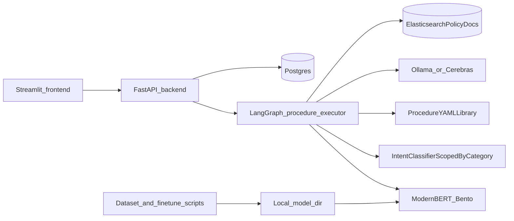

# BitBot

Agentic bot for any business — **BitBot** bootstrap with **category classification** using **ModernBERT** (fine-tuned `MoritzLaurer/ModernBERT-base-zeroshot-v2.0`), a **procedure-driven LangGraph** API flow, and **Docker Compose** for **frontend** (Streamlit), **backend** (FastAPI), **PostgreSQL**, **Elasticsearch**, and a **BentoML** classifier service.

## Architecture (overview)



- **Frontend** (`frontend/`): Streamlit chat UI calling `POST /classify` with `full_flow` for session + LangGraph + LLM branches.
- **Backend** (`backend/`): FastAPI + **LangGraph** (`backend/agent/issue_graph.py`): Bento category classification → intent classification (scoped to that category) → YAML procedure load (`backend/procedures/*.yaml`) → hybrid required-data validation → structured step execution.
- **Tool APIs** (`backend/api/routes/tools.py`): DB-backed tool endpoints used by procedures (`/tools/order-status`, `/tools/product-lookup`, `/tools/refund-context`).
- **Escalation API** (`backend/api/routes/escalations.py`): in-chat escalation decision endpoint (`/escalations/decision`) for accept/reject UX.
- **Procedures** (`backend/procedures/`): One YAML blueprint per intent. Blueprints define `required_data` and ordered steps (`retrieval`, `logic_gate`, `tool_call`, `llm_response`, `interrupt`) used to enforce deterministic control flow.
- **ModernBERT** (`services/modernbert_bento/`): BentoML service loading a local fine-tuned checkpoint.
- **Policy source**: Policy constraints/content remain external to procedures and come from Elasticsearch-backed policy documents through retrieval steps.
- **Data stores**: Postgres (pgvector-ready schema in `infra/postgres/init.sql`) plus Elasticsearch for policy retrieval.
- **Product catalog**: `products` table in Postgres backs `get_product_info` tool-calling.

## Documentation

| Topic | Document |
|-------|----------|
| Dataset creation, binary split, fine-tuning, evaluation, serving | [docs/finetuning-modernbert.md](docs/finetuning-modernbert.md) |

## Quickstart (Docker)

1. Copy environment file:

   ```bash
   cp .env.example .env
   ```

   Set `POSTGRES_USER`, `POSTGRES_PASSWORD`, and any overrides.

2. **Train and export** a model to `training/models/modernbert_finetuned/` (see [docs/finetuning-modernbert.md](docs/finetuning-modernbert.md)). The `modernbert` container mounts this path read-only; without valid tokenizer + model files, that service will not start.

3. Start services:

   ```bash
   docker compose up --build
   ```

4. Open the UI at **http://localhost:8501** (backend API: **http://localhost:8000**).

5. Try classification (Bento only, no Postgres/LLM):

   ```bash
   curl -s -X POST http://localhost:8000/classify -H "Content-Type: application/json" -d "{\"text\":\"My order is late\",\"full_flow\":false}"
   ```

6. Full conversation flow (Postgres + LangGraph + local Ollama): set `NO_ISSUE_MODEL_*`, `VALIDATION_MODEL_*`, and `OLLAMA_BASE_URL` in `.env` (see `.env.example`). Ensure Postgres is up and Ollama is reachable from the backend (e.g. `host.docker.internal:11434` on Docker Desktop). Then:

   ```bash
   curl -s -X POST http://localhost:8000/classify -H "Content-Type: application/json" -d "{\"text\":\"Hello\",\"full_flow\":true}"
   ```

7. Escalation decision action (for pending `interrupt` steps in procedures):

   ```bash
   curl -s -X POST http://localhost:8000/escalations/decision -H "Content-Type: application/json" -d "{\"session_id\":\"<session-uuid>\",\"action_id\":\"<action-id>\",\"decision\":\"accept\"}"
   ```

## API Surface (Core)

- `POST /classify`: classification-only (`full_flow=false`) or full LangGraph orchestration (`full_flow=true`).
- `POST /tools/order-status`: DB-backed order lookup tool.
- `POST /tools/product-lookup`: DB-backed product catalog lookup tool.
- `POST /tools/refund-context`: DB-backed refund context lookup tool.
- `POST /escalations/decision`: accept/reject a pending escalation action for a session.

## Repository layout

| Path | Purpose |
|------|---------|
| `backend/` | FastAPI app, LangGraph flow, classifier HTTP client |
| `frontend/` | Streamlit demo |
| `services/modernbert_bento/` | BentoML ModernBERT binary classifier |
| `training/scripts/` | Bitext dataset build, binary split, `train_modernbert.py`, `eval_modernbert.py` |
| `training/data/samples/` | Small committed examples for smoke tests |
| `infra/postgres/` | Postgres init SQL (pgvector + tables) |
| `docs/` | Detailed guides |

## Development (local, without Docker)

```bash
python -m venv .venv
.venv\Scripts\activate   # Windows
pip install -r backend/requirements.txt
set CLASSIFIER_BENTOML_URL=http://localhost:3000/classify
uvicorn backend.main:app --reload --host 0.0.0.0 --port 8000
```

Run tests:

```bash
pip install -r backend/requirements.txt
pytest backend/tests
```

## License

Add your license here.
