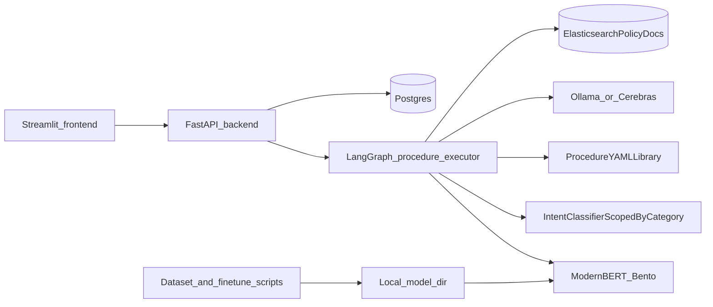

# BitBot

Agentic bot for any business — **BitBot** bootstrap with **category classification** using **ModernBERT** (fine-tuned `MoritzLaurer/ModernBERT-base-zeroshot-v2.0`), a **procedure-driven LangGraph** API flow, and **Docker Compose** for **frontend** (Streamlit), **backend** (FastAPI), **PostgreSQL**, **Elasticsearch**, and a **BentoML** classifier service.

## Architecture (overview)



- **Frontend** (`frontend/`): Streamlit chat UI calling `POST /classify` with `full_flow` for session + LangGraph + LLM branches.
- **Backend** (`backend/`): FastAPI + **LangGraph** (`backend/agent/issue_graph.py`): Bento category classification → intent classification (scoped to that category) → YAML procedure load (`backend/procedures/*.yaml`) → hybrid required-data validation → structured step execution.
- **Tool APIs** (`backend/api/routes/tools.py`): DB-backed tool endpoints used by procedures (`/tools/order-status`, `/tools/product-lookup`, `/tools/refund-context`).
- **Escalation API** (`backend/api/routes/escalations.py`): in-chat escalation decision endpoint (`/escalations/decision`) for accept/reject UX.
- **Procedures** (`backend/procedures/`): One YAML blueprint per intent. Blueprints define `required_data` and ordered steps (`retrieval`, `logic_gate`, `tool_call`, `llm_response`, `interrupt`) used to enforce deterministic control flow.
- **ModernBERT** (`services/modernbert_bento/`): BentoML service loading a local fine-tuned checkpoint.
- **Policy source**: Policy constraints/content remain external to procedures and come from Elasticsearch-backed policy documents through retrieval steps.
- **Data stores**: Postgres for sessions, orders, products, and related app data (`infra/postgres/init.sql`). **Policy retrieval** uses **Elasticsearch only** (no vector search in Postgres).
- **Product catalog**: `products` table in Postgres backs `get_product_info` tool-calling.

## Documentation

| Topic | Document |
|-------|----------|
| Dataset creation, binary split, fine-tuning, evaluation, serving | [docs/finetuning-modernbert.md](docs/finetuning-modernbert.md) |
| Index Foodpanda policy Markdown in Elasticsearch | [docs/elasticsearch-foodpanda-policy-docs.md](docs/elasticsearch-foodpanda-policy-docs.md) |

## How to add data to Elasticsearch

Policy retrieval (`backend/rag/policy_retriever.py`) queries Elasticsearch with a `multi_match` on **`title`**, **`content`**, and **`tags`**. Configure the cluster with `.env` (see `.env.example`): `ES_HOST`, `ES_PORT`, `ES_SCHEME`, **`ES_POLICY_INDEX`** (default: `policy_docs`), and `ES_TIMEOUT_SECONDS`. With Docker Compose, these are passed into the `backend` service.

**Foodpanda sample policies:** to index the Markdown under `data/policy_docs/foodpanda/policy_docs/`, use the bundled script (see [docs/elasticsearch-foodpanda-policy-docs.md](docs/elasticsearch-foodpanda-policy-docs.md)):

```bash
python scripts/upload_foodpanda_policy_docs.py --create-index --host localhost
```

The generic **`curl`** / `_bulk` flow below uses **`docker compose exec`** into the **`elasticsearch`** service so `curl` runs inside the container; Elasticsearch listens on **9200** in that container (Compose maps it to the host for debugging, but these examples stay fully in Docker).

1. **Ensure Elasticsearch is running** (e.g. `docker compose up` with the `elasticsearch` service healthy).

2. **Create an index** (optional; dynamic mapping is enough for a quick start). Replace `policy_docs` if you use a custom `ES_POLICY_INDEX`:

   ```bash
   docker compose exec -T elasticsearch curl -s -X PUT "http://localhost:9200/policy_docs" -H "Content-Type: application/json" -d "{}"
   ```

3. **Index documents** with `_bulk`. Each source document must include the fields the retriever searches. **Bash** can stream a heredoc into the container (stdin is forwarded to `curl`):

   ```bash
   docker compose exec -T elasticsearch curl -s -X POST "http://localhost:9200/_bulk" -H "Content-Type: application/x-ndjson" --data-binary @- <<'EOF'
   {"index":{"_index":"policy_docs","_id":"refund-overview"}}
   {"title":"Refund policy overview","content":"Customers may request a refund within 30 days of purchase.","tags":["refund","policy"]}
   {"index":{"_index":"policy_docs","_id":"shipping-late"}}
   {"title":"Late delivery","content":"If your order is late, contact support with your order number.","tags":["shipping","order"]}
   EOF
   ```

   **PowerShell** or any shell: save the NDJSON (action line + JSON line per document) to `bulk.ndjson` in the project root and run:

   ```powershell
   Get-Content bulk.ndjson -Raw | docker compose exec -T elasticsearch curl -s -X POST "http://localhost:9200/_bulk" -H "Content-Type: application/x-ndjson" --data-binary @-
   ```

   **Bash** one-liner equivalent:

   ```bash
   docker compose exec -T elasticsearch curl -s -X POST "http://localhost:9200/_bulk" -H "Content-Type: application/x-ndjson" --data-binary @- < bulk.ndjson
   ```

4. **Verify** with a search that matches the app query shape:

   ```bash
   docker compose exec -T elasticsearch curl -s -X POST "http://localhost:9200/policy_docs/_search" -H "Content-Type: application/json" -d "{\"size\":3,\"query\":{\"multi_match\":{\"query\":\"refund\",\"fields\":[\"title^2\",\"content\",\"tags\"]}}}"
   ```

5. **Optional source material**: Markdown under [`data/policy_docs/`](data/policy_docs/) can be loaded with [`scripts/upload_foodpanda_policy_docs.py`](scripts/upload_foodpanda_policy_docs.py) (Foodpanda folder) or adapted for your own bulk NDJSON.

If `ES_HOST` is unset, retrieval returns no documents. The readiness endpoint only records that Elasticsearch env vars are configured, not cluster health.

## Quickstart (Docker)

1. Create `.env` from `.env.example` (example uses a tiny Alpine container so you do not rely on host `cp`):

   ```bash
   docker run --rm -v "$PWD:/w" -w /w alpine cp .env.example .env
   ```

   **PowerShell** (repository root):

   ```powershell
   docker run --rm -v "${PWD}:/w" -w /w alpine cp .env.example .env
   ```

   Set `POSTGRES_USER`, `POSTGRES_PASSWORD`, and any overrides.

2. **Train and export** a model to `training/models/modernbert_finetuned/` (see [docs/finetuning-modernbert.md](docs/finetuning-modernbert.md)). The `modernbert` container mounts this path read-only; without valid tokenizer + model files, that service will not start.

3. Start services:

   ```bash
   docker compose up --build
   ```

4. Open the UI at **http://localhost:8501** (backend API: **http://localhost:8000**).

5. Try classification (Bento only, no Postgres/LLM). The **`elasticsearch`** image includes `curl` and shares the Compose network with **`backend`**, so call the API by service name:

   ```bash
   docker compose exec -T elasticsearch curl -s -X POST http://backend:8000/classify -H "Content-Type: application/json" -d "{\"text\":\"My order is late\",\"full_flow\":false}"
   ```

6. Full conversation flow (Postgres + LangGraph + local Ollama): set `NO_ISSUE_MODEL_*`, `VALIDATION_MODEL_*`, and `OLLAMA_BASE_URL` in `.env` (see `.env.example`). Ensure Postgres is up and Ollama is reachable from the backend (e.g. `host.docker.internal:11434` on Docker Desktop). Then:

   ```bash
   docker compose exec -T elasticsearch curl -s -X POST http://backend:8000/classify -H "Content-Type: application/json" -d "{\"text\":\"Hello\",\"full_flow\":true}"
   ```

7. Escalation decision action (for pending `interrupt` steps in procedures):

   ```bash
   docker compose exec -T elasticsearch curl -s -X POST http://backend:8000/escalations/decision -H "Content-Type: application/json" -d "{\"session_id\":\"<session-uuid>\",\"action_id\":\"<action-id>\",\"decision\":\"accept\"}"
   ```

## API Surface (Core)

- `POST /classify`: classification-only (`full_flow=false`) or full LangGraph orchestration (`full_flow=true`).
- `POST /tools/order-status`: DB-backed order lookup tool.
- `POST /tools/product-lookup`: DB-backed product catalog lookup tool.
- `POST /tools/refund-context`: DB-backed refund context lookup tool.
- `POST /escalations/decision`: accept/reject a pending escalation action for a session.

## Repository layout

| Path | Purpose |
|------|---------|
| `backend/` | FastAPI app, LangGraph flow, classifier HTTP client |
| `frontend/` | Streamlit demo |
| `services/modernbert_bento/` | BentoML ModernBERT binary classifier |
| `training/scripts/` | Bitext dataset build, binary split, `train_modernbert.py`, `eval_modernbert.py` |
| `training/data/samples/` | Small committed examples for smoke tests |
| `infra/postgres/` | Postgres init SQL (core tables) used by **Docker Compose** |
| `db/postgres/` | Rerunnable dummy schema + **idempotent** seed data for procedure/tool scenarios (separate from Compose init) |
| `docs/` | Detailed guides |

### Dummy Postgres dataset (`db/postgres/`)

Docker Compose initializes the database from [`infra/postgres/init.sql`](infra/postgres/init.sql). For **expanded test users, orders, refunds, and products** aligned with [`backend/procedures/`](backend/procedures/), apply the SQL **in order** via `psql` in the **`postgres`** container (from the repo root, stack running):

1. [`db/postgres/01_schema.sql`](db/postgres/01_schema.sql) — drops and recreates the dummy tables (rerunnable).

   ```bash
   docker compose exec -T postgres psql -U "${POSTGRES_USER:-admin}" -d "${POSTGRES_DB:-ecom_support}" -f - < db/postgres/01_schema.sql
   ```

2. [`db/postgres/02_seed.sql`](db/postgres/02_seed.sql) — loads data using `INSERT … ON CONFLICT … DO UPDATE` (safe to run **multiple times** without duplicate-key failures).

   ```bash
   docker compose exec -T postgres psql -U "${POSTGRES_USER:-admin}" -d "${POSTGRES_DB:-ecom_support}" -f - < db/postgres/02_seed.sql
   ```

3. Optional: [`db/postgres/03_smoke_checks.sql`](db/postgres/03_smoke_checks.sql) — sanity queries after load.

   ```bash
   docker compose exec -T postgres psql -U "${POSTGRES_USER:-admin}" -d "${POSTGRES_DB:-ecom_support}" -f - < db/postgres/03_smoke_checks.sql
   ```

**PowerShell** (repo root; set variables if they differ from defaults):

```powershell
Get-Content db/postgres/01_schema.sql -Raw | docker compose exec -T postgres psql -U admin -d ecom_support -f -
Get-Content db/postgres/02_seed.sql -Raw | docker compose exec -T postgres psql -U admin -d ecom_support -f -
Get-Content db/postgres/03_smoke_checks.sql -Raw | docker compose exec -T postgres psql -U admin -d ecom_support -f -
```

This dummy schema is **not** the same as `infra/postgres/init.sql` (different `orders` shape and related tables). Use a dedicated database or run these scripts when you want SQL-level fixtures for procedures; wiring the backend to that database may require matching column names to [`backend/db/`](backend/db/) repos.

## Development (Docker)

Run the test suite inside the **`backend`** service. The app imports the `backend` package from `/app`, so set **`PYTHONPATH=/app`** when invoking tests:

```bash
docker compose exec backend env PYTHONPATH=/app pytest backend/tests
```

## License

Add your license here.
