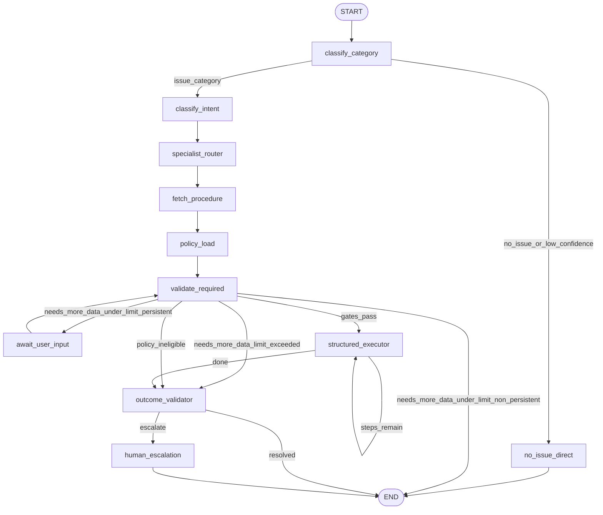

# BitBot agent architecture

BitBot runs a staged, procedure-driven LangGraph in [`backend/agent/issue_graph.py`](../backend/agent/issue_graph.py). The graph remains deterministic: YAML procedures in [`backend/procedures/`](../backend/procedures/) define execution steps; LLM usage is limited to explicit stages (chitchat, intent extraction, required-data validation, and `llm_response` steps).

This document tracks the implemented architecture and its contracts.

## Pipeline topology

## State model

`IssueGraphState` keeps spec-aligned orchestration fields plus concise runtime snapshots and per-stage debug metadata.

- Session: `text`, `session_id`, `messages`, `issue_locked`
- Classification + intent: `category`, `confidence`, `intent`, `problem_to_solve`
- Routing + procedure: `specialist_agent_id`, `tool_registry_scope`, `procedure_namespace`, `procedure_id`, `todo_list`, `current_step_index`
- Policy + gates: `policy_constraints`, `validation_ok`, `validation_missing`, `eligibility_ok`, `validation_wait_count`, `validation_wait_limit`
- Retry + loop controls: `classify_intent_attempts`, `policy_load_attempts`, `executor_turn_count`, `enable_persistent_wait_interrupt`
- Outcome + handoff: `outcome_status`, `output_validation`, `context_summary`, `escalation_bundle`
- Debug + UI JSON: `agent_state`, `stage_metadata`, `assistant_metadata`, concise `context_data`

## Stage contracts (implemented)

### 1. `classify_category`
- Uses ModernBERT via [`backend/rag/query_classifier.py`](../backend/rag/query_classifier.py).
- Honors session lock (reuses locked issue values).

### 2. `no_issue_direct`
- Runs when category is `no_issue` **or** confidence is below `CATEGORY_CONFIDENCE_THRESHOLD`.
- Produces direct assistant reply without procedure execution.

### 3. `classify_intent`
- Produces strict JSON intent/problem summary using category and transcript.
- Optionally constrains intent with Postgres allowlist (`get_intents_for_category`).

### 4. `specialist_router`
- Deterministic routing node that sets specialist/tool namespace metadata.
- No autonomous tool selection occurs here.

### 5. `fetch_procedure`
- Loads procedure blueprint using fallback chain in [`backend/agent/procedures.py`](../backend/agent/procedures.py):
  1) `(category, intent)`  
  2) `(category, *_general)`  
  3) `(unknown, *_general)`

### 6. `policy_load`
- Builds policy query from category/intent/problem/user text.
- Retrieves docs through [`backend/rag/policy_retriever.py`](../backend/rag/policy_retriever.py).
- Retries retrieval with broader query candidates up to `AGENT_MAX_NODE_TURNS`.
- Produces `policy_constraints` as JSON variable maps:
  - `variables: {variable_name: value}`
  - `validation_results: {check_name: {valid, reason, actual_value, ...}}`
- Uses deterministic validation helpers for duration/date checks, set-membership checks, and arithmetic threshold checks.

### 7. `validate_required`
- Runs required-data validation (`validation_ok`, `validation_missing`).
- Applies eligibility gate (`eligibility_ok`) from `policy_constraints`.
- Retries validation model failures up to `AGENT_MAX_NODE_TURNS`.
- Keeps waiting for user data across turns with a bounded counter (`AGENT_VALIDATION_MAX_USER_WAITS`, defaults to `AGENT_MAX_NODE_TURNS`).
- In persistent mode (`backend/agent/persistent_agent.py`), pauses using `await_user_input` interrupt and resumes in the same validation stage on the next turn.
- Routes to `END`, `await_user_input`, `outcome_validator`, or `structured_executor`.

### 8. `structured_executor`
- Deterministic procedure execution loop across step types:
  - `retrieval`
  - `tool_call`
  - `logic_gate`
  - `interrupt`
  - `llm_response`
- Updates `context_data`, `current_step_index`, and optionally `final_response`.
- Applies `executor_turn_count` safety cap (`AGENT_MAX_NODE_TURNS`) on self-loop progression.

### 9. `outcome_validator`
- Assigns final `outcome_status` (`resolved`, `needs_more_data`, `policy_ineligible`, `tool_error`, `step_error`, `pending_escalation`, `unresolvable`).
- Verifies execution outcomes against source-of-truth data where needed (example: cancellation is confirmed with DB order status).
- Generates `output_validation` and `context_summary` for follow-up turns and debugging.
- Decides terminal vs escalation routing.

### 9a. `human_escalation`
- Builds `escalation_bundle` from state and marks escalation metadata.
- Ends graph with escalation-ready payload.

## HTTP integration compatibility

[`POST /classify`](../backend/api/routes/classify.py) remains the stable external contract.

- `full_flow=false`: Bento classifier only (no graph invoke).
- `full_flow=true`: session-aware graph invoke with lock semantics.
- Default runtime uses persistent graph execution (`AGENT_PERSISTENT_MODE=1`) via [`backend/agent/persistent_agent.py`](../backend/agent/persistent_agent.py); non-persistent execution remains available.
- Existing response shape is preserved; richer internal outcomes are surfaced through `assistant_metadata` (`agent_state`, `stage_metadata`, `output_validation`, `context_summary`).
- Session resolution behavior remains unchanged (`user_confirms_resolution` short-circuit + `graph_suggests_session_resolved`).

## Procedure compatibility

Procedure schema remains in [`backend/agent/procedures.py`](../backend/agent/procedures.py) and keeps existing YAML assets compatible. Validation now additionally enforces duplicate step-id detection and deterministic fallback-chain resolution helpers.

## Node retry behavior

- `classify_intent`: retries LLM parse/extract loop up to `AGENT_MAX_NODE_TURNS` before conservative fallback.
- `policy_load`: retries retrieval with progressively broader query candidates up to `AGENT_MAX_NODE_TURNS`.
- `validate_required`: retries validation-model exceptions up to `AGENT_MAX_NODE_TURNS`.
- `validate_required` (persistent mode): pauses at `await_user_input` and resumes in-node on next user turn until wait limit is reached.
- `structured_executor`: self-loop exits when `executor_turn_count >= AGENT_MAX_NODE_TURNS` even if blueprint index has not advanced.

## Environment variables

- `AGENT_MAX_NODE_TURNS`: global per-node retry and loop cap (default `20`).
- `AGENT_VALIDATION_MAX_USER_WAITS`: max user wait turns before escalation (defaults to `AGENT_MAX_NODE_TURNS`).
- `AGENT_CHECKPOINT_DB`: sqlite path for LangGraph checkpoint persistence (default `agent_checkpoints.db`).
- `AGENT_PERSISTENT_MODE`: `1/true` enables persistent runner for `/classify full_flow`; `0/false` uses non-persistent graph.

## Related routes

- [`backend/api/routes/tools.py`](../backend/api/routes/tools.py): external tool endpoints.
- [`backend/api/routes/escalations.py`](../backend/api/routes/escalations.py): accept/reject escalation API.
