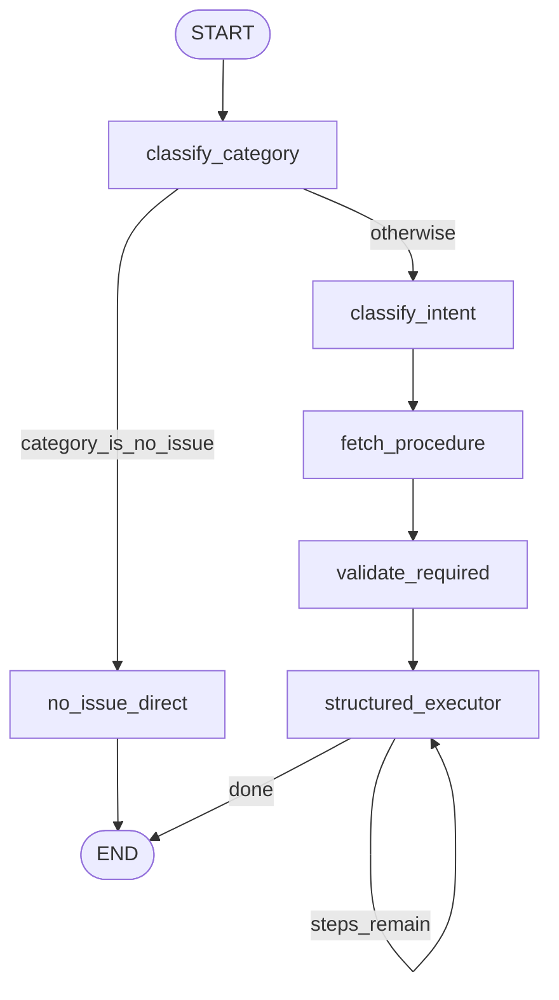

# BitBot issue agent architecture

The support “agent” is a **procedure-driven LangGraph** compiled from [`backend/agent/issue_graph.py`](../backend/agent/issue_graph.py). It runs over a single typed state object, **`IssueGraphState`**, and executes **YAML blueprints** (one per intent) loaded from [`backend/procedures/`](../backend/procedures/) via [`backend/agent/procedures.py`](../backend/agent/procedures.py). The LLM is used for routing branches (category is already decided by the classifier), validation, chit-chat, and drafting `llm_response` steps—it does **not** choose which procedure steps exist; the blueprint does.

For broader product design (Fin-style procedures), see [`specs/procedures.md`](../specs/procedures.md). This document tracks the **running code**.

---

## State: `IssueGraphState`

Defined in [`issue_graph.py`](../backend/agent/issue_graph.py) (search for `class IssueGraphState`).

| Field | Role |
|--------|------|
| `text` | Latest user utterance |
| `session_id`, `messages` | Session context (filled by HTTP layer before `invoke`) |
| `issue_locked` | When true, intent/problem are taken from state, not re-inferred |
| `category`, `intent`, `confidence`, `problem_to_solve` | Routing and procedure selection |
| `procedure_id`, `todo_list`, `current_step_index` | Loaded blueprint and execution cursor |
| `context_data` | Accumulated outputs from retrieval, tools, gates |
| `validation_ok`, `validation_missing` | Hybrid required-field check |
| `final_response` | Assistant text for this graph run |
| `assistant_metadata` | Branch flags, model names, pending HITL, errors |

---

## Graph topology

Compiled in [`build_issue_classification_graph()`](../backend/agent/issue_graph.py).



Routing functions (not separate graph nodes):

- **After `classify_category`:** [`_route_after_category`](../backend/agent/issue_graph.py) — if normalized category is `no_issue`, go to `no_issue_direct`; else `classify_intent`.
- **After `structured_executor`:** [`_should_continue`](../backend/agent/issue_graph.py) — if `current_step_index >= len(todo_list)` then `end`, else loop to `structured_executor`.

---

## HTTP integration (outside the graph)

[`POST /classify`](../backend/api/routes/classify.py) with `full_flow=true`:

1. Requires Postgres ([`postgres_configured`](../backend/db/postgres.py)); otherwise HTTP 503.
2. Creates or loads a session; appends the user message; loads transcript into `messages_for_graph`.
3. **Issue lock:** If the session already has an active intent and is not resolved, `issue_locked` is set to true for [`run_conversation_graph`](../backend/agent/issue_graph.py), so category/intent are reused rather than re-inferred.
4. **Resolution short-circuit:** If locked and [`user_confirms_resolution`](../backend/agent/issue_graph.py) matches the latest text, the handler marks the session resolved and returns without invoking the graph.
5. Invokes the compiled graph, then optionally appends the assistant message with merged metadata.
6. **Persistence:** If not locked, [`update_session_active_issue`](../backend/db/messages_repo.py) stores category, intent, confidence, and problem text. If [`graph_suggests_session_resolved`](../backend/agent/issue_graph.py) is true for the graph output, [`mark_session_resolved`](../backend/db/messages_repo.py) runs.

`full_flow=false` only calls [`QueryClassifier.classify`](../backend/rag/query_classifier.py) and does not run LangGraph.

---

## Graph nodes

Each node is a pure function `IssueGraphState -> IssueGraphState` (merge/update pattern).

### `classify_category`

**Purpose:** Assign a support **category** and score from the latest semantics (not from LLM).

**Pseudocode:**

```
if state.issue_locked:
  return state with text normalized
result = queryClassifier.classify(state.text)
return state + { category, confidence } from result
```

**Implementation:** [`_classify_category_node`](../backend/agent/issue_graph.py); classifier: [`QueryClassifier`](../backend/rag/query_classifier.py) → Bento endpoint `CLASSIFIER_BENTOML_URL`.

---

### `no_issue_direct`

**Purpose:** Small-talk / non-issue path: general assistant reply, empty procedure.

**Pseudocode:**

```
messages = systemPrompt + transcriptForLLM(state.messages)
reply = chatCompletion(NO_ISSUE provider/model, messages)
return state with intent=no_issue_chat, empty todo_list, final_response=reply,
  assistant_metadata.branch = no_issue_direct
```

**Implementation:** [`_no_issue_direct_node`](../backend/agent/issue_graph.py); LLM: [`chat_completion`](../backend/llm/providers.py) (`NO_ISSUE_MODEL_PROVIDER`, `NO_ISSUE_MODEL`, optional `NO_ISSUE_SYSTEM_PROMPT`).

---

### `classify_intent`

**Purpose:** Stable **intent** label and **problem_to_solve** for the session, scoped by category.

**Pseudocode:**

```
if state.issue_locked:
  return state with existing intent/problem; metadata.intent_classifier = session_locked
category = normalizeCategory(state.category)
allowed = postgresConfigured ? getIntentsForCategory(category) : []
build system prompt (JSON-only: intent, problem_to_solve; if allowed non-empty, restrict intent to list or {category}_general)
raw = chatCompletion(INTENT_MODEL_PROVIDER, INTENT_MODEL, messages)
data = extractJsonObject(raw)
intent = clampToAllowed(data.intent, allowed, fallback {category}_general)
return state + intent, problem_to_solve, metadata
```

**Implementation:** [`_classify_intent_node`](../backend/agent/issue_graph.py), [`_load_allowed_intents`](../backend/agent/issue_graph.py) → [`get_intents_for_category`](../backend/db/intents_repo.py); [`normalize_category_key`](../backend/rag/required_fields.py); [`extract_json_object`](../backend/llm/providers.py).

---

### `fetch_procedure`

**Purpose:** Resolve YAML blueprint for `(category, intent)` and initialize the step list.

**Pseudocode:**

```
bp = getBlueprint(category, intent)
if bp is None:
  bp = getFallbackBlueprint(category) or getFallbackBlueprint("unknown")
if still None:
  return final_response = could not map..., empty todo
return state + procedure_id, todo_list from bp.steps, current_step_index=0, context_data copy
```

**Implementation:** [`_fetch_procedure_node`](../backend/agent/issue_graph.py); [`get_blueprint_by_category_intent`](../backend/agent/procedures.py), [`get_fallback_blueprint`](../backend/agent/procedures.py), [`as_dict`](../backend/agent/procedures.py).

---

### `validate_required`

**Purpose:** Before running steps, ask an LLM whether the transcript satisfies blueprint `required_data` fields.

**Pseudocode:**

```
bp = getBlueprint(category, intent)
if no bp or no required_data: return validation_ok=True
raw = chatCompletion(VALIDATION_MODEL_PROVIDER, VALIDATION_MODEL, transcript + field specs)
data = extractJsonObject(raw)
if not data.valid:
  final_response = composed prompts for missing fields
  current_step_index = len(todo_list)  # skip procedure execution
else:
  validation_ok = true
return state with validation_ok, validation_missing, metadata
```

**Implementation:** [`_validate_required_data_node`](../backend/agent/issue_graph.py); prompts via [`_build_missing_prompts`](../backend/agent/issue_graph.py).

---

### `structured_executor`

**Purpose:** Run **at most one** procedure step per graph invocation, advance index (or jump / terminate on gates, interrupts, errors).

**Pseudocode:**

```
if index >= len(todo): return state
step = todo[index]
context = copy(state.context_data)

switch step.type:
  retrieval:
    context += searchPolicyDocs(state.text) shaped fields
  validate_required_data:
    context["validate_required_data"] = true  // YAML compatibility only
  tool_call:
    dispatch by step.tool -> check_order_status | product_catalog_lookup | refund_context_lookup
    unknown tool -> final_response error, jump to end of todo
  logic_gate:
    branch = evalCondition(step.condition, context)  // see security note below
    jump state to step id on_true / on_false
  interrupt:
    if user message contains accept/reject -> finalize and end todo
    else -> set pending_human_action metadata, final_response = step.message, end todo
  llm_response:
    final_response = draftResponse(state, step); index++
  default:
    error metadata + safe final_response + end todo

if normal step: index++
return state with context_data, current_step_index, final_response as set
```

**Implementation:** [`_structured_executor_node`](../backend/agent/issue_graph.py).

| Step `type` | Key functions |
|-------------|----------------|
| `retrieval` | [`_retrieve_policy`](../backend/agent/issue_graph.py) → [`search_policy_docs`](../backend/rag/policy_retriever.py) |
| `tool_call` | [`_check_order_status`](../backend/agent/issue_graph.py), [`_lookup_product_info`](../backend/agent/issue_graph.py), [`_lookup_refund_context`](../backend/agent/issue_graph.py) |
| `logic_gate` | [`_evaluate_condition`](../backend/agent/issue_graph.py), [`_jump_to_step`](../backend/agent/issue_graph.py) |
| `interrupt` | [`_handle_interrupt_step`](../backend/agent/issue_graph.py), [`_extract_escalation_decision`](../backend/agent/issue_graph.py) |
| `llm_response` | [`_draft_response`](../backend/agent/issue_graph.py) |

**Security note:** [`_evaluate_condition`](../backend/agent/issue_graph.py) evaluates YAML `condition` strings with Python `eval` over `context_data` and empty `__builtins__`. Conditions should be simple boolean expressions over trusted keys. Misconfigured or hostile YAML in a writable procedures directory is a serious risk—treat procedure files as code.

---

## Procedure step types (YAML)

Declared as `StepType` in [`procedures.py`](../backend/agent/procedures.py): `validate_required_data`, `retrieval`, `tool_call`, `logic_gate`, `interrupt`, `llm_response`.

| `type` | Typical YAML fields | Runtime behavior |
|--------|---------------------|------------------|
| `retrieval` | `tool` (label), query uses latest `text` | Elasticsearch policy search; results in `context_data` |
| `tool_call` | `tool` | In-process repo calls (order / product / refund), not HTTP tools route by default |
| `logic_gate` | `condition`, `on_true`, `on_false` | Jump to step `id` |
| `interrupt` | `message`, `action_type`, `on_accept_message`, `on_reject_message` | Sets `pending_human_action` until user says accept/reject in chat |
| `llm_response` | optional `message` | LLM reply using transcript + `context_data` JSON |
| `validate_required_data` | — | No-op in executor (graph already validated) |

Blueprint schema: [`ProcedureBlueprint`](../backend/agent/procedures.py), [`ProcedureStep`](../backend/agent/procedures.py). Optional directory override: `PROCEDURES_DIR`.

---

## Related HTTP APIs

| Route | Role |
|-------|------|
| [`backend/api/routes/tools.py`](../backend/api/routes/tools.py) | DB-backed tools (`/tools/order-status`, `/tools/product-lookup`, `/tools/refund-context`) for external callers; graph tool steps use in-process repo helpers by default |
| [`backend/api/routes/escalations.py`](../backend/api/routes/escalations.py) | `/escalations/decision` for accept/reject UX alongside in-graph interrupt metadata |

In-graph interrupts also parse **accept** / **reject** from the latest user messages ([`_extract_escalation_decision`](../backend/agent/issue_graph.py)).

---

## Entry helpers

| Function | Use |
|----------|-----|
| [`run_issue_classification`](../backend/agent/issue_graph.py) | Category only (Bento), no graph |
| [`run_conversation_graph`](../backend/agent/issue_graph.py) | Full `invoke` with lock/bootstrap fields |
| [`get_issue_classification_graph`](../backend/agent/issue_graph.py) | Singleton compiled graph |

Session resolution signal for analytics/UI: [`graph_suggests_session_resolved`](../backend/agent/issue_graph.py).
