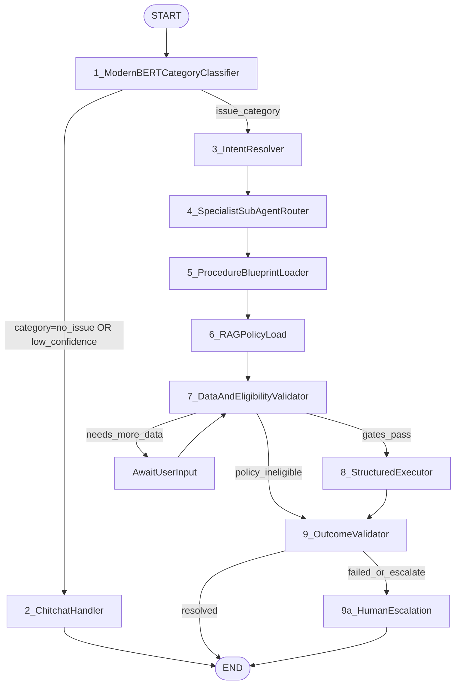

# Agent Pipeline Spec

This document defines the target architecture for BitBot's production-grade agent pipeline.
It is intentionally aspirational and implementation-agnostic: implementation should conform to this spec.

## Implementation traceability

- **Runtime behavior, graph nodes, state fields, and HTTP integration** are documented in [docs/agent.md](../docs/agent.md).
- **LangGraph implementation** lives in [`backend/agent/issue_graph.py`](../backend/agent/issue_graph.py) (staged pipeline, procedure execution, outcome validation).
- **Persistent execution** (checkpoint + interrupt/resume for `/classify` full flow) is in [`backend/agent/persistent_agent.py`](../backend/agent/persistent_agent.py) when enabled via `AGENT_PERSISTENT_MODE`.

## 1) Pipeline Overview



## 2) Stage Contracts

Each stage defines purpose, input contract, output contract, hard rules, and failure behavior.

### Stage 1 - ModernBERT Category Classifier

**Purpose**
- Classify the latest user utterance into a support category using ML inference only.

**Inputs**
- `user_text: str`
- Optional conversation context metadata (session-level, non-semantic)

**Outputs**
- `category: str`
- `confidence: float` in `[0.0, 1.0]`

**Rules**
- No LLM usage in this stage.
- Category labels are a closed enum sourced from model training labels.
- Confidence threshold is mandatory and configurable.
- If `confidence < category_confidence_threshold`, route as `no_issue`.

**Failure Modes**
- Model unavailable or timeout: return deterministic fallback category `no_issue` with `confidence=0.0` and set `assistant_metadata.classifier_error`.

### Stage 2 - Chitchat Handler (No-Issue Branch)

**Purpose**
- Handle non-issue conversational queries and terminate safely.

**Inputs**
- `messages: list[Message]`
- `category`, `confidence`

**Outputs**
- `final_response: str`
- `outcome_status: "resolved"`

**Rules**
- Trigger only when `category == "no_issue"` or Stage 1 confidence is below threshold.
- Use an LLM with a strict commerce-safe system prompt.
- No procedure loading, no policy retrieval, and no tool invocation.

**Failure Modes**
- LLM failure: produce a deterministic safe fallback response and terminate.

### Stage 3 - Intent Resolver

**Purpose**
- Resolve request intent and summarize the session's problem in a stable structured form.

**Inputs**
- `category: str`
- `messages: list[Message]`
- `intent_allowlist_by_category: dict[str, list[str]]`

**Outputs**
- `intent: str`
- `problem_to_solve: str`

**Rules**
- LLM must return strict JSON: `{"intent": "...", "problem_to_solve": "..."}`.
- Intent must be constrained to the category allowlist.
- If output is not in allowlist, fallback to `{category}_general`.
- Intent becomes session-stable after first successful resolution (lock behavior).

**Failure Modes**
- Invalid JSON or model error: fallback intent to `{category}_general`, derive conservative `problem_to_solve`.

### Stage 4 - Specialist Sub-Agent Routing

**Purpose**
- Route execution to a category-owned specialist sub-agent graph.

**Inputs**
- `category: str`
- `intent: str`

**Outputs**
- `specialist_agent_id: str`
- `tool_registry_scope: str`
- `procedure_namespace: str`

**Rules**
- Pure deterministic routing, no LLM.
- Routing table is configuration-driven, not hardcoded in logic.
- Unknown category maps to `GeneralAgent`.
- Specialist agents own their tool permissions and procedure namespace boundaries.

**Failure Modes**
- Missing route config: fallback to `GeneralAgent` and set route warning metadata.

### Stage 5 - Procedure Blueprint Loader

**Purpose**
- Load and validate the procedure blueprint selected by `(category, intent)`.

**Inputs**
- `category: str`
- `intent: str`
- `procedure_store` (YAML or equivalent source of truth)

**Outputs**
- `procedure_id: str`
- `todo_list: list[ProcedureStep]`
- `current_step_index: int` (must initialize to `0`)

**Rules**
- Validate blueprint against `ProcedureBlueprint` schema at load time.
- Fallback chain is mandatory:
  1. `(category, intent)`
  2. `(category, fallback)`
  3. `(unknown, fallback)`
- Steps must have unique `id` values within a blueprint.

**Failure Modes**
- No valid blueprint found: set terminal error response and route to Stage 9 (Outcome Validator).

### Stage 6 - RAG Policy Load -> `PolicyConstraints`

**Purpose**
- Retrieve policy evidence and convert it into a typed constraints object for execution gating.

**Inputs**
- `category: str`
- `intent: str`
- `problem_to_solve: str`
- `policy_retriever`

**Outputs**
- `policy_constraints: PolicyConstraints`

**Rules**
- Retrieval query must include category, intent, and problem summary.
- Raw policy chunks are transformed by an extraction step into typed fields.
- `PolicyConstraints` is mandatory for all policy-governed categories.
- If no policy evidence is found, default to non-auto-resolvable constraints.

**Failure Modes**
- Retrieval/extraction failure sets conservative constraints:
  - `eligible=False`
  - `auto_resolvable=False`
  - escalation required

### Stage 7 - Data + Eligibility Validation (Two-Gate)

**Purpose**
- Validate data completeness and policy eligibility before execution.

**Inputs**
- `messages`
- `required_data` from blueprint
- `policy_constraints`

**Outputs**
- `validation_ok: bool`
- `validation_missing: list[str]`
- `eligibility_ok: bool`

**Rules**
- Gate A (Data): all required fields must be present or inferable.
- Gate B (Eligibility): `policy_constraints.eligible` must be true.
- Execution may continue to Stage 8 only if both gates pass.
- If Gate A fails, ask for missing data and wait for user input loop.
- The wait loop is bounded by `max_node_turns` (config: `AGENT_MAX_NODE_TURNS`).
- In persistent mode, Stage 7 pauses with interrupt and resumes at the same node on the next user turn.

**Failure Modes**
- Gate B fails: set `outcome_status="policy_ineligible"` and route to Stage 9.
- Validation model failure: conservative fail-closed behavior (request missing data).

### Stage 8 - Structured Executor

**Purpose**
- Execute the blueprint deterministically, one step per graph cycle.

**Inputs**
- `todo_list`
- `current_step_index`
- `context_data`
- `policy_constraints`

**Outputs**
- Updated `context_data`
- Updated `current_step_index`
- Optional `final_response`
- Optional execution metadata and errors

**Rules**
- Supported step types:
  - `logic_gate`
  - `tool_call`
  - `llm_response`
  - `retrieval`
  - `interrupt`
- `tool_call` uses category-scoped tool registry only.
- Unknown tool/step type is a hard execution error.
- `logic_gate` condition evaluation uses a structured condition object (`op`, `field`, optional `value`) dispatched through an allowlisted operator map.
- Loop continues until terminal state or interruption.
- Executor loops are bounded by `executor_turn_count <= max_node_turns`.

**Failure Modes**
- Tool failures produce `outcome_status="tool_error"`.
- Step schema or dispatch failures produce `outcome_status="step_error"`.
- Interrupt sets pending escalation state when unresolved.

### Stage 9 - Outcome Validator

**Purpose**
- Determine the authoritative terminal or continuation outcome after validation/execution.

**Inputs**
- Full `AgentState`

**Outputs**
- `outcome_status: OutcomeStatus`
- Route decision: `END`, `AwaitUserInput`, or `Stage9a_HumanEscalation`

**Rules**
- This is an explicit graph node, not an implicit helper.
- Must always set one outcome status from the taxonomy.
- Approved taxonomy:
  - `resolved`
  - `needs_more_data`
  - `policy_ineligible`
  - `step_error`
  - `tool_error`
  - `pending_escalation`
  - `unresolvable`

**Failure Modes**
- If validator cannot classify outcome, default to `unresolvable` and escalate.

### Stage 9a - Human Escalation

**Purpose**
- Escalate unresolved, ineligible, or failed flows with complete context for human takeover.

**Inputs**
- Full `AgentState`
- `outcome_status`

**Outputs**
- `escalation_bundle: EscalationBundle`
- User-facing escalation acknowledgement
- `session_flags.escalated=True`

**Rules**
- Escalation bundle must include:
  - `session_id`, `category`, `intent`, `problem_to_solve`
  - full transcript
  - `context_data` snapshot
  - `policy_constraints`
  - `procedure_id` and `last_step_id`
  - `outcome_status` and failure reason
- Persist escalation bundle to handoff queue/store.
- Post-escalation user messages route to human support queue.

**Failure Modes**
- If escalation persistence fails, emit fallback user notice and retry via durable queue policy.

## 3) Canonical Typed Schemas (Target)

```python
from typing import Any, Literal, TypedDict


class Message(TypedDict):
    role: Literal["system", "user", "assistant"]
    content: str
    timestamp: str


class ProcedureStep(TypedDict, total=False):
    id: str
    type: Literal["logic_gate", "tool_call", "llm_response", "retrieval", "interrupt"]
    tool: str
    condition: dict[str, Any]
    on_true: str
    on_false: str
    message: str
    required_data: list[str]


class ProcedureBlueprint(TypedDict):
    id: str
    category: str
    intent: str
    required_data: list[dict[str, str]]
    steps: list[ProcedureStep]
    fallback_response: str


class PolicyConstraints(TypedDict):
    eligible: bool
    reason: str
    conditions: list[str]
    time_limit_hours: int | None
    requires_evidence: bool
    auto_resolvable: bool
    raw_chunks: list[str]


OutcomeStatus = Literal[
    "resolved",
    "needs_more_data",
    "policy_ineligible",
    "step_error",
    "tool_error",
    "pending_escalation",
    "unresolvable",
]


class EscalationBundle(TypedDict):
    session_id: str
    category: str
    intent: str
    problem_to_solve: str
    transcript: list[Message]
    context_data: dict[str, Any]
    policy_constraints: PolicyConstraints
    procedure_id: str
    last_step_id: str | None
    outcome_status: OutcomeStatus
    reason: str


class AgentState(TypedDict):
    # Session
    session_id: str
    text: str
    messages: list[Message]
    issue_locked: bool

    # Classification
    category: str
    confidence: float

    # Intent
    intent: str
    problem_to_solve: str

    # Routing and Procedure
    specialist_agent_id: str
    procedure_id: str
    todo_list: list[ProcedureStep]
    current_step_index: int

    # Policy and Validation
    policy_constraints: PolicyConstraints | None
    validation_ok: bool | None
    validation_missing: list[str]
    eligibility_ok: bool | None

    # Execution
    context_data: dict[str, Any]
    final_response: str | None
    executor_turn_count: int

    # Outcome and Handoff
    outcome_status: OutcomeStatus | None
    escalation_bundle: EscalationBundle | None
    assistant_metadata: dict[str, Any]
    max_node_turns: int
    classify_intent_attempts: int
    policy_load_attempts: int
```

## 4) Operational Invariants

- Stage ordering is fixed: 1 -> 2/3 -> 4 -> 5 -> 6 -> 7 -> 8 -> 9 -> 9a/END.
- Only Stage 2 and Stage 8 (`llm_response`) may emit user-facing natural language content.
- Stage 6 must run before Stage 7 for policy-governed intents.
- No tool invocation is allowed before Stage 5 blueprint load and Stage 7 gate pass.
- Every run must end with exactly one `outcome_status`.
- Every escalation must include a complete `EscalationBundle`.

## 5) Design Principles

1. Deterministic over autonomous: blueprints define decisions; LLMs only perform scoped reasoning.
2. LLM scope is narrow and auditable: generation is allowed only in explicitly approved stages.
3. Policy is a typed contract: execution gates rely on `PolicyConstraints`, not free-form text.
4. Validation is dual-gated: data completeness and eligibility are independent controls.
5. Specialist sub-agents enforce bounded context and least-privilege tool access.
6. Escalation is first-class: failures and ineligible paths are intentional, not edge cases.
7. Blueprint assets are governed artifacts: schema-validated, versioned, and reviewable.
8. Observability is mandatory: every stage emits trace metadata and deterministic outcomes.

## 6) Retry and Persistence Policy

- `AGENT_MAX_NODE_TURNS` defines the default retry and loop ceiling for node-local retries.
- `classify_intent` retries strict-JSON extraction up to `max_node_turns` before falling back to `{category}_general`.
- `policy_load` retries retrieval with progressively broader queries up to `max_node_turns`.
- `validate_required` retries transient validation-model failures up to `max_node_turns`.
- Persistent mode uses checkpointing + interrupt/resume to keep the flow anchored at Stage 7 until data is complete or wait limit is reached.
- `structured_executor` enforces a deterministic safety cap via `executor_turn_count`.
